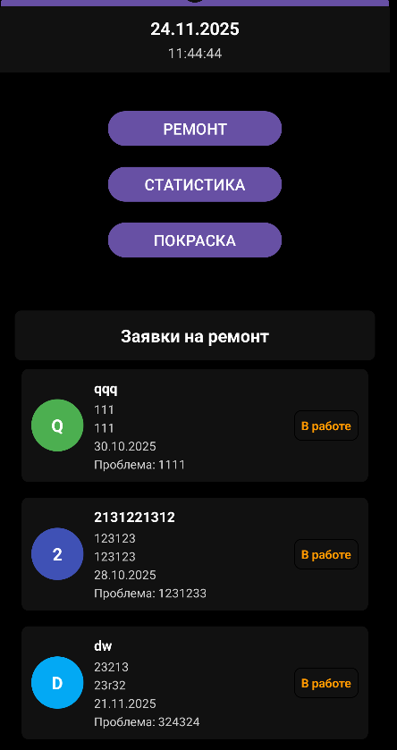
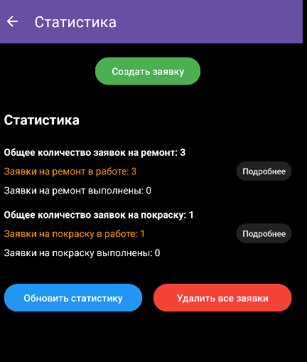
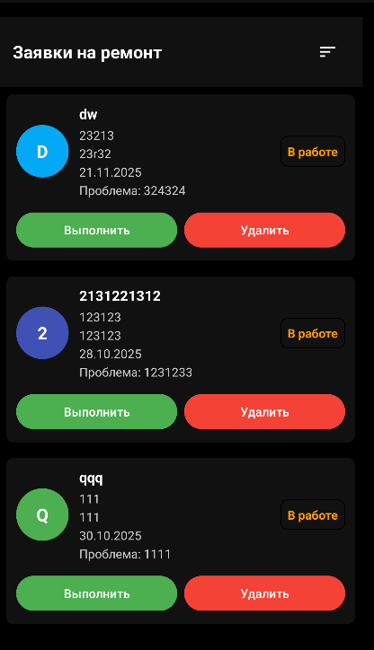
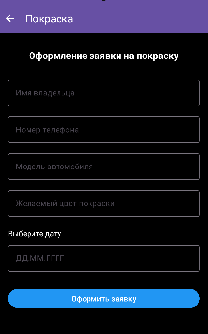
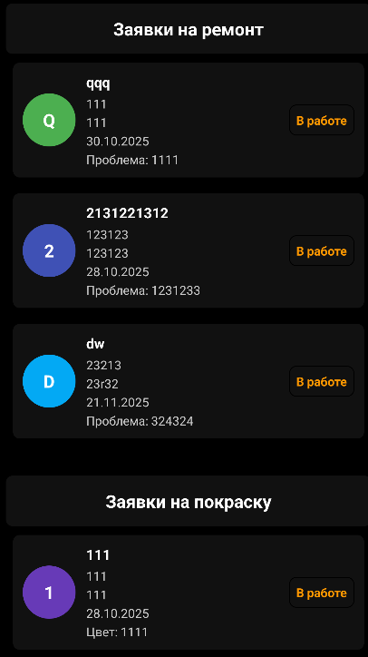

# 📱 MellstroyRepair — Менеджер заявок для сервисных центров 🔧⚡

**Melstroy repair** — это удобное Android-приложение для автоматизации работы мастерской или сервисного центра.  
Позволяет оформлять заявки на ремонт, отслеживать статус, управлять процессами и смотреть аналитику 📊🚀.

---

## ✨ Основные функции приложения

### 🏠 Главный экран (Dashboard) 

Главная страница предоставляет быстрый доступ к ключевым инструментам.

📸 **Главный экран приложения**  


**Навигационные кнопки:**

- 🛠 **Ремонт/покраска** — создание заявки на ремонт/покраску.
- 📊 **Статистика** — сводка по всем заявкам.

.

**Список активных задач в подробной статистике:**  
- 🔹 Отображение общего количества заявок по ремонту/покраскам  
- 🔹 Создание заявки
- 🔹 Подробнее, чтобы увидеть все заявки и взаимодействие с ними
---

## ⚙️ Управление заявками в статистике 🧰📝

Для взаимодействия с записью нажмите нужную вам кнопку 👆

.

Доступно:

- ✏️ **Выполнить** — изменение данных клиента/устройства  
- 🗑 **Удалить** — удаление заявки  
- 🔄 **Отсортировать** — переключение стадий по времени (*новые*, *старые*)  

---

## 📝 Создание новой заявки 🛠📋

Форма оформления ремонта:

📸 **Форма создания заявки**  


**Поля:**

- 👤 Имя клиента  
- 📞 Номер телефона (маска +7 (XXX)...)  
- 📱 Модель устройства  
- 📅 Дата приёма   

⚠️ Прошедшие даты недоступны — исключены ошибки оформления.

После заполнения используется кнопка **Оформить заявку** 💾✨.

---

## 📊 Статистика и Аналитика 🚀📈

Экран сводки содержит ключевые показатели:

📸 **Экран статистики на главном экране**  



Отображается:

- Все заявки в работе
- Все выполненные заявки
- При нажатии на кнопку **Заявки на ремонт** или **Заявки на покраску** вы сможете редактировать заявку в подробном меню статистики

---

## 🛠 Технологический стек ⚙️💻

- **Java** — основной язык  
- **MVVM** — архитектурный паттерн  
- **XML + Material Design** — интерфейс  
- **SQLite** — база данных  
- **LiveData** — реактивные обновления  

---

## 📥 Установка и запуск 🚀📲

1. 🔽 Склонируйте репозиторий:  
   ```bash
   git clone <(https://github.com/your-username/Project1.git)>
